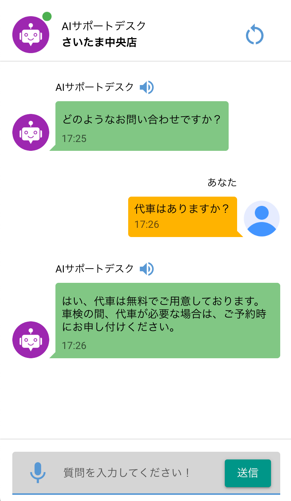

# RAG Chatbot Application
[日本語版](README_ja.md)
## Overview

<table style="width:100%">
  <tr>
    <td style="width:50%; padding:10px;">
      
    </td>
    <td style="width:50%; padding:10px;">
      This project is a chat application that uses Retrieval-Augmented Generation (RAG) to provide intelligent responses. It allows users to interact with a chatbot that can answer questions based on a knowledge base stored in a vector database. The application supports both text and voice input and is designed to be easily customizable for different shops or services.
    </td>
  </tr>
</table>

## Technologies Used

*   **NiceGUI:** A Python-based framework for creating web applications with a focus on simplicity and ease of use. It's used for building the user interface and handling user interactions.
*   **Langchain:** A framework for developing applications powered by language models. It provides the core functionality for connecting to language models and building conversational agents.
*   **LangGraph:** A library for building conversational agents. It's used to define the flow of the conversation and manage the state of the conversation.
*   **OpenAI:** Used for text generation (GPT-4o-mini), speech-to-text (Whisper), and text-to-speech. It provides the language models and APIs for generating text, converting speech to text, and converting text to speech.
*   **Upstash Vector:** A vector database used to store and retrieve knowledge base information. It stores the knowledge base in a vector format, allowing for efficient similarity searches.
*   **Supabase:** A backend-as-a-service platform used for user data storage. It stores user data, such as shop information and admin credentials.
*   **Pydub:** A library for audio manipulation. It's used to convert audio files to the correct format for speech-to-text processing.
*   **Authlib:** A library for implementing OAuth authentication. It's used to authenticate users with Google OAuth.
*   **FastAPI:** A modern, high-performance web framework for building APIs. It's used to create API endpoints for handling user authentication and other tasks.

## Key Components

*   **`app/main_page.py`**: Defines the main page of the chat application, including UI elements and logic for handling user input and displaying responses. It uses NiceGUI to create the user interface and Langchain to connect to the language model.
*   **`app/admin_page.py`**: Implements an admin interface for managing user accounts and the chat database. It allows administrators to add, edit, and delete user accounts and manage the knowledge base.
*   **`app/components/chat_input.py`**: Creates the input component for users to type their questions or use voice input. It uses NiceGUI to create the input field and buttons and handles the logic for sending messages to the chatbot.
*   **`app/components/chat_message.py`**: Defines how chat messages are displayed in the UI. It uses NiceGUI to create the chat message elements and handles the logic for displaying text and audio messages.
*   **`app/components/openai_speech_to_text.py`**: Handles the conversion of speech to text using OpenAI's Whisper model. It uses the OpenAI API to transcribe audio files and returns the transcribed text.
*   **`app/components/openai_text_to_speech.py`**: Implements text-to-speech functionality using OpenAI. It uses the OpenAI API to generate audio from text and returns the audio file.
*   **`app/components/vector_db.py`**: Manages the connection to the Upstash vector database and provides functions for querying and updating the knowledge base. It uses the Upstash Vector API to store and retrieve knowledge base information.
*   **`app/state.py`**: Manages the state of the chat application, including the conversation history and configuration settings. It stores the conversation history, user settings, and other application-specific data.
*   **`app/utils/python_utils.py`**: Provides utility functions for handling audio data and other tasks. It includes functions for converting audio files to different formats and handling audio data received from the frontend.
*   **`app/google_oauth.py`**: Implements Google OAuth for user authentication. It uses the Authlib library to authenticate users with Google OAuth.
*   **`app/utils/js_utils.py`**: Provides JavaScript utilities for recording audio in the browser. It includes functions for starting and stopping audio recording and converting audio data to base64 format.
*   **`app/utils/custom_css.py`**: Defines custom CSS styles for the application. It includes styles for animations, colors, and other visual elements.
*   **`app/components/user_db.py`**: Manages user data in Supabase, providing functions to retrieve and update user information.

## Development Environment Setup

1.  **Clone the repository:**

    ```bash
    git clone https://github.com/masykur8d/langgraph_rag_chatbot.git
    cd langgraph_rag_chatbot
    ```

2.  **Set up environment variables:**

    *   Create a `.env` file in the root directory.
    *   Add the necessary environment variables to the `.env` file. You can refer to the [.env](.env) file for the required variables.
    *   Ensure you replace the placeholder values with your actual credentials and API keys.

    ```
    NICEGUI_SECRET_KEY='<YOUR_NICEGUI_SECRET_KEY>'
    OPENAI_API_KEY='<YOUR_OPENAI_API_KEY>'
    UPSTASH_VECTOR_REST_URL='<YOUR_UPSTASH_VECTOR_REST_URL>'
    UPSTASH_VECTOR_REST_TOKEN='<YOUR_UPSTASH_VECTOR_REST_TOKEN>'
    SUPABASE_URL='<YOUR_SUPABASE_URL>'
    SUPABASE_ANON_KEY='<YOUR_SUPABASE_ANON_KEY>'
    LANGSMITH_TRACING=true
    LANGSMITH_ENDPOINT='<YOUR_LANGSMITH_ENDPOINT>'
    LANGSMITH_API_KEY='<YOUR_LANGSMITH_API_KEY>'
    LANGSMITH_PROJECT='<YOUR_LANGSMITH_PROJECT_NAME>'
    GOOGLE_EMAIL='<YOUR_GOOGLE_EMAIL>'
    GOOGLE_CLIENT_ID='<YOUR_GOOGLE_CLIENT_ID>'
    GOOGLE_CLIENT_SECRET='<YOUR_GOOGLE_CLIENT_SECRET>'
    ```

3.  **Install dependencies:**

    ```bash
    pip install -r requirements.txt
    ```

4.  **Run the application:**

    ```bash
    python app/main_page.py
    ```

## Docker Setup

1.  **Build the Docker image:**

    ```bash
    docker build -t chat-rag .
    ```

2.  **Run the Docker container:**

    ```bash
    docker run -p 408:408 -v $(pwd)/.env:/code/.env chat-rag
    ```

    *   `-p 408:408` maps port 408 on the host to port 408 in the container.
    *   `-v $(pwd)/.env:/code/.env` mounts the `.env` file from the host to the container, allowing the application to access the environment variables.

## Notes

*   The application uses Google OAuth for authentication. Make sure to configure the Google OAuth credentials correctly in the `.env` file.
*   The application uses Upstash Vector for storing the knowledge base. Make sure to configure the Upstash Vector credentials correctly in the `.env` file.
*   The application uses Supabase for storing user data. Make sure to configure the Supabase credentials correctly in the `.env` file.
*   The application uses OpenAI for text generation, speech-to-text, and text-to-speech. Make sure to configure the OpenAI API key correctly in the `.env` file.
*   The application uses LangSmith for tracing. Make sure to configure the LangSmith credentials correctly in the `.env` file.
*   The [Dockerfile](Dockerfile) installs `ffmpeg` to enable audio processing.
*   The [requirements.txt](requirements.txt) file lists all the Python dependencies required for the project.
*   The `app/` directory contains the source code for the application.
*   The `app/utils/` directory contains utility functions for the application.
*   The `app/components/` directory contains reusable UI components for the application.
*   The `app/icon/` directory contains the icons used in the application.
*   The `app/admin_page.py` file implements an admin interface for managing user accounts and the chat database.
*   The `app/google_oauth.py` file implements Google OAuth for user authentication.
*   The `app/main_page.py` file defines the main page of the chat application.
*   The `app/state.py` file manages the state of the chat application.
*   The `app/components/chat_input.py` file creates the input component for users to type their questions or use voice input.
*   The `app/components/chat_message.py` file defines how chat messages are displayed in the UI.
*   The `app/components/openai_speech_to_text.py` file handles the conversion of speech to text using OpenAI's Whisper model.
*   The `app/components/openai_text_to_speech.py` file implements text-to-speech functionality using OpenAI.
*   The `app/components/vector_db.py` file manages the connection to the Upstash vector database and provides functions for querying and updating the knowledge base.
*   The `app/components/user_db.py` file manages user data in Supabase, providing functions to retrieve and update user information.
*   The `app/utils/python_utils.py` file provides utility functions for handling audio data and other tasks.
*   The `app/utils/js_utils.py` file provides JavaScript utilities for recording audio in the browser.
*   The `app/utils/custom_css.py` file defines custom CSS styles for the application.
