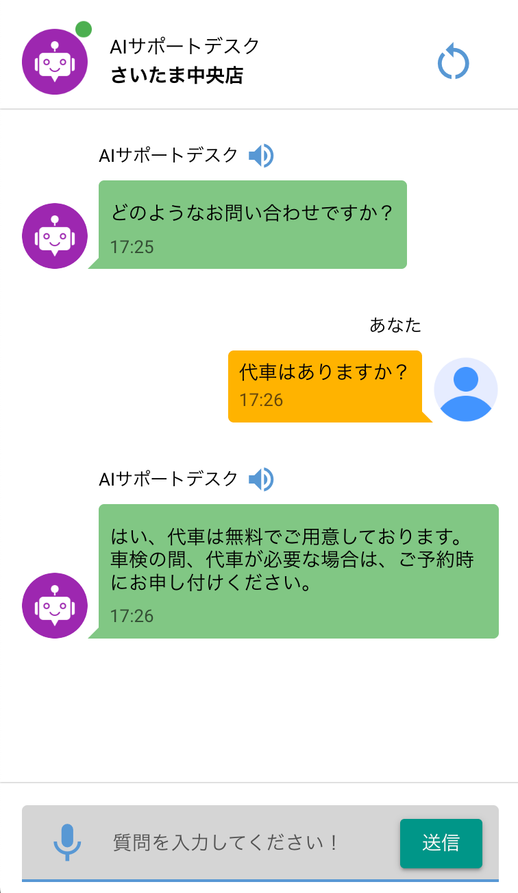

# RAGチャットボットアプリケーション (日本語版)
[Original English Version](README.md)

## 概要

<table style="width:100%">
  <tr>
    <td style="width:50%; padding:10px;">
      
    </td>
    <td style="width:50%; padding:10px;">
      このプロジェクトは、Retrieval-Augmented Generation (RAG) を使ったチャットアプリケーションです。ユーザーは、ベクトルデータベースにある知識ベースを使って、質問に答えるチャットボットと会話できます。テキストと音声の両方の入力に対応しており、いろいろな店やサービスに合わせて簡単にカスタマイズできます。
    </td>
  </tr>
</table>

## 使用技術

*   **NiceGUI:** 簡単で使いやすいPythonのウェブアプリケーションフレームワーク。ユーザーインターフェースの作成に使います。
*   **Langchain:** 言語モデルを使ったアプリケーションを開発するためのフレームワーク。言語モデルへの接続や会話エージェントの構築に使います。
*   **LangGraph:** 会話エージェントを構築するためのライブラリ。会話の流れを定義し、会話の状態を管理するために使います。
*   **OpenAI:** テキスト生成 (GPT-4o-mini)、音声テキスト変換 (Whisper)、テキスト音声変換に使います。テキストの生成、音声からテキストへの変換、テキストから音声への変換のための言語モデルとAPIを提供します。
*   **Upstash Vector:** 知識ベースを保存・検索するためのベクトルデータベース。知識ベースをベクトル形式で保存し、効率的な類似性検索を可能にします。
*   **Supabase:** ユーザーデータストレージのためのBackend-as-a-Serviceプラットフォーム。ショップ情報や管理者認証情報などのユーザーデータを保存します。
*   **Pydub:** 音声操作のためのライブラリ。音声ファイルを音声テキスト変換処理に適した形式に変換するために使用します。
*   **Authlib:** OAuth認証を実装するためのライブラリ。Google OAuthでユーザーを認証するために使用します。
*   **FastAPI:** APIを構築するためのモダンで高性能なウェブフレームワーク。ユーザー認証やその他のタスクを処理するためのAPIエンドポイントを作成するために使用します。

## 主要コンポーネント

*   **`app/main_page.py`**: チャットアプリケーションのメインページを定義します。ユーザー入力の処理や応答の表示などのUI要素とロジックが含まれます。NiceGUIを使ってユーザーインターフェースを作成し、Langchainを使って言語モデルに接続します。
*   **`app/admin_page.py`**: ユーザーアカウントとチャットデータベースを管理するための管理インターフェースを実装します。管理者は、ユーザーアカウントの追加、編集、削除、および知識ベースの管理を行うことができます。
*   **`app/components/chat_input.py`**: ユーザーが質問を入力したり、音声入力を使用したりするための入力コンポーネントを作成します。NiceGUIを使って入力フィールドとボタンを作成し、チャットボットにメッセージを送信するロジックを処理します。
*   **`app/components/chat_message.py`**: チャットメッセージをUIに表示する方法を定義します。NiceGUIを使ってチャットメッセージ要素を作成し、テキストメッセージと音声メッセージを表示するロジックを処理します。
*   **`app/components/openai_speech_to_text.py`**: OpenAIのWhisperモデルを使って、音声をテキストに変換します。OpenAI APIを使って音声ファイルを文字起こしし、文字起こしされたテキストを返します。
*   **`app/components/openai_text_to_speech.py`**: OpenAIを使ってテキスト音声変換機能を実装します。OpenAI APIを使ってテキストから音声を生成し、音声ファイルを返します。
*   **`app/components/vector_db.py`**: Upstashベクトルデータベースへの接続を管理し、知識ベースのクエリと更新のための機能を提供します。Upstash Vector APIを使って知識ベース情報を保存および検索します。
*   **`app/state.py`**: 会話履歴や設定など、チャットアプリケーションの状態を管理します。会話履歴、ユーザー設定、その他のアプリケーション固有のデータを保存します。
*   **`app/utils/python_utils.py`**: 音声データやその他のタスクを処理するためのユーティリティ機能を提供します。音声ファイルを異なる形式に変換したり、フロントエンドから受信した音声データを処理したりするための機能が含まれています。
*   **`app/google_oauth.py`**: ユーザー認証のためにGoogle OAuthを実装します。Authlibライブラリを使ってGoogle OAuthでユーザーを認証します。
*   **`app/utils/js_utils.py`**: ブラウザで音声を録音するためのJavaScriptユーティリティを提供します。音声録音の開始と停止、および音声データをbase64形式に変換するための機能が含まれています。
*   **`app/utils/custom_css.py`**: アプリケーションのカスタムCSSスタイルを定義します。アニメーション、色、その他の視覚要素のスタイルが含まれています。
*   **`app/components/user_db.py`**: Supabaseでユーザーデータを管理し、ユーザー情報の取得と更新のための機能を提供します。

## 開発環境のセットアップ

1.  **リポジトリをクローンします:**

    ```bash
    git clone https://github.com/masykur8d/langgraph_rag_chatbot.git
    cd langgraph_rag_chatbot
    ```

2.  **環境変数を設定します:**

    *   ルートディレクトリに `.env` ファイルを作成します。
    *   必要な環境変数を `.env` ファイルに追加します。必要な変数については、[.env](.env) ファイルを参照してください。
    *   プレースホルダーの値を実際の認証情報とAPIキーに置き換えてください。

    ```
    NICEGUI_SECRET_KEY='<YOUR_NICEGUI_SECRET_KEY>'
    OPENAI_API_KEY='<YOUR_OPENAI_API_KEY>'
    UPSTASH_VECTOR_REST_URL='<YOUR_UPSTASH_VECTOR_REST_URL>'
    UPSTASH_VECTOR_REST_TOKEN='<YOUR_UPSTASH_VECTOR_REST_TOKEN>'
    SUPABASE_URL='<YOUR_SUPABASE_URL>'
    SUPABASE_ANON_KEY='<YOUR_SUPABASE_ANON_KEY>'
    LANGSMITH_TRACING=true
    LANGSMITH_ENDPOINT='<YOUR_LANGSMITH_ENDPOINT>'
    LANGSMITH_API_KEY='<YOUR_LANGSMITH_API_KEY>'
    LANGSMITH_PROJECT='<YOUR_LANGSMITH_PROJECT_NAME>'
    GOOGLE_EMAIL='<YOUR_GOOGLE_EMAIL>'
    GOOGLE_CLIENT_ID='<YOUR_GOOGLE_CLIENT_ID>'
    GOOGLE_CLIENT_SECRET='<YOUR_GOOGLE_CLIENT_SECRET>'
    ```

3.  **依存関係をインストールします:**

    ```bash
    pip install -r requirements.txt
    ```

4.  **アプリケーションを実行します:**

    ```bash
    python app/main_page.py
    ```

## Dockerのセットアップ

1.  **Dockerイメージをビルドします:**

    ```bash
    docker build -t chat-rag .
    ```

2.  **Dockerコンテナを実行します:**

    ```bash
    docker run -p 408:408 -v $(pwd)/.env:/code/.env chat-rag
    ```

    *   `-p 408:408` は、ホストのポート408をコンテナのポート408にマップします。
    *   `-v $(pwd)/.env:/code/.env` は、ホストからコンテナに `.env` ファイルをマウントし、アプリケーションが環境変数にアクセスできるようにします。

## 注意事項

*   アプリケーションは、認証にGoogle OAuthを使用します。 `.env` ファイルでGoogle OAuthの認証情報を正しく設定してください。
*   アプリケーションは、知識ベースの保存にUpstash Vectorを使用します。 `.env` ファイルでUpstash Vectorの認証情報を正しく設定してください。
*   アプリケーションは、ユーザーデータの保存にSupabaseを使用します。 `.env` ファイルでSupabaseの認証情報を正しく設定してください。
*   アプリケーションは、テキスト生成、音声テキスト変換、およびテキスト音声変換にOpenAIを使用します。 `.env` ファイルでOpenAI APIキーを正しく設定してください。
*   アプリケーションは、トレースにLangSmithを使用します。 `.env` ファイルでLangSmithの認証情報を正しく設定してください。
*   [Dockerfile](Dockerfile) は、音声処理を有効にするために `ffmpeg` をインストールします。
*   [requirements.txt](requirements.txt) ファイルには、プロジェクトに必要なすべてのPython依存関係がリストされています。
*   `app/` ディレクトリには、アプリケーションのソースコードが含まれています。
*   `app/utils/` ディレクトリには、アプリケーションのユーティリティ機能が含まれています。
*   `app/components/` ディレクトリには、アプリケーションの再利用可能なUIコンポーネントが含まれています。
*   `app/icon/` ディレクトリには、アプリケーションで使用されるアイコンが含まれています。
*   `app/admin_page.py` ファイルは、ユーザーアカウントとチャットデータベースを管理するための管理インターフェースを実装します。
*   `app/google_oauth.py` ファイルは、ユーザー認証のためにGoogle OAuthを実装します。
*   `app/main_page.py` ファイルは、チャットアプリケーションのメインページを定義します。
*   `app/state.py` ファイルは、チャットアプリケーションの状態を管理します。
*   `app/components/chat_input.py` ファイルは、ユーザーが質問を入力したり、音声入力を使用したりするための入力コンポーネントを作成します。
*   `app/components/chat_message.py` ファイルは、チャットメッセージをUIに表示する方法を定義します。
*   `app/components/openai_speech_to_text.py` ファイルは、OpenAIのWhisperモデルを使って、音声をテキストに変換します。
*   `app/components/openai_text_to_speech.py` ファイルは、OpenAIを使ってテキスト音声変換機能を実装します。
*   `app/components/vector_db.py` ファイルは、Upstashベクトルデータベースへの接続を管理し、知識ベースのクエリと更新のための機能を提供します。
*   `app/components/user_db.py` ファイルは、Supabaseでユーザーデータを管理し、ユーザー情報の取得と更新のための機能を提供します。
*   `app/utils/python_utils.py` ファイルは、音声データやその他のタスクを処理するためのユーティリティ機能を提供します。
*   `app/utils/js_utils.py` ファイルは、ブラウザで音声を録音するためのJavaScriptユーティリティを提供します。
*   `app/utils/custom_css.py` ファイルは、アプリケーションのカスタムCSSスタイルを定義します。
